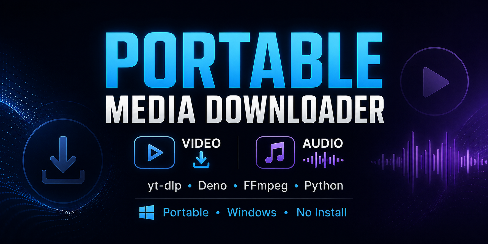

# Portable Media Downloader

[English](README.md) | [Русский](README.ru.md)

Portable-загрузчик видео и аудио для Windows на базе **yt-dlp**, **Python**, **Deno** и **FFmpeg**.

Устанавливать Python, Deno или FFmpeg в систему не требуется.




## Возможности

* Загрузка видео в MP4
* Загрузка аудио в MP3, WAV, M4A и OPUS
* Пресеты 720p / 1080p / 1440p / 2160p
* Загрузка плейлистов и каналов
* Загрузка субтитров
* Загрузка обложек и метаданных
* Загрузка отдельных фрагментов видео
* Использование cookies браузера
* Несколько fallback-режимов для YouTube
* Локальные Python, Deno и FFmpeg
* Архив уже скачанных файлов

## Скачать

Откройте страницу **Releases**:

https://github.com/kirdmya/portable-media-downloader/releases

Скачайте последний архив:

```text
PortableMediaDownloader-v1.0.0-win64.zip
```

Распакуйте его в любую папку и запустите:

```text
run.bat
```

Готово.

Отдельно устанавливать Python, Deno или FFmpeg не нужно.

## Portable

Все необходимые компоненты находятся внутри папки программы:

```text
PortableMediaDownloader/
├── downloader.py
├── run.bat
├── runtime/
│   └── python/
├── tools/
│   ├── deno/
│   └── ffmpeg/
├── downloads/
└── data/
```

Папку программы можно перенести на другой диск, в другую директорию или на другой совместимый компьютер с Windows x64.

## Сборка из исходников

Клонируйте репозиторий:

```powershell
git clone https://github.com/YOUR_USERNAME/portable-media-downloader.git
cd portable-media-downloader
```

Запустите:

```powershell
Set-ExecutionPolicy -Scope Process Bypass
.\setup_portable.ps1
```

После завершения сборки:

```text
run.bat
```

## Обновление yt-dlp

Запустите:

```text
update_python_packages.bat
```

yt-dlp обновится внутри portable Python и не затронет системный Python.

## Если YouTube перестал скачиваться

YouTube регулярно меняет механизмы работы.

Если появилась ошибка:

1. Обновите yt-dlp.
2. Проверьте наличие Deno.
3. Повторите загрузку.
4. Попробуйте fallback-режим или cookies браузера.

Некоторым видео может требоваться дополнительная авторизация или PO Token.

## Поддерживаемые сайты

Программа использует **yt-dlp**, поэтому может работать со многими сайтами, поддерживаемыми yt-dlp, а не только с YouTube.

## Важно

Используйте программу только для контента, который вам разрешено скачивать.

Пользователь самостоятельно отвечает за соблюдение законодательства, авторских прав и правил используемых сервисов.

## Используемые проекты

* [yt-dlp](https://github.com/yt-dlp/yt-dlp)
* [Python](https://www.python.org/)
* [Deno](https://deno.com/)
* [FFmpeg](https://ffmpeg.org/)

## Лицензия

MIT License.

Сторонние компоненты распространяются на условиях собственных лицензий.
